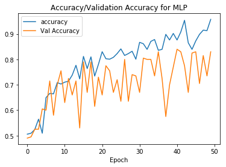
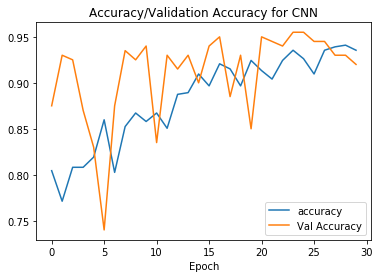
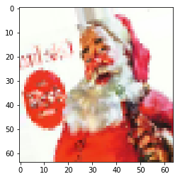
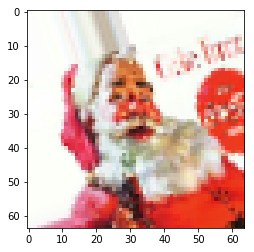
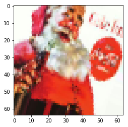
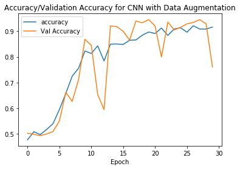

# Convolutional Neural Networks Lab

## Objective

In this lab, we'll learn and implement best practices for structuring a Deep Learning/Computer Vision project.  We'll then use design and train a Convolutional Neural Network to classify if an image contains Santa!

## 1. Properly store your images

When you're analyzing your image data, file management is important. We will be using the santa images again, but this time, they are just stored in two folders: `santa` and `not_santa`, under. We want to work with a `train`, `validation` and `test` data set now, as we know by now that this is the best way to go. 

Let's import libraries `os` and `shutil`, as we'll need them to create the new folders and move the new files in there.  Import these modules in the cell below. 


```python
import os, shutil
```

Create three objects representing the existing directories 'data/santa/' as `data_santa_dir` and 'data/not_santa/' as `data_not_santa_dir`. We will create a new directory 'split/' as `new_dir`, where we will split the data set in three groups (or three subdirectories) 'train', 'test' and 'validation', each containing `santa` and `not_santa` subfolders. The final desired structure is represented below:


```python
data_santa_dir = 'data/santa/'
data_not_santa_dir = 'data/not_santa/'
new_dir = 'split/'
```

You can use `os.listdir()` to create an object that stores all the relevant image names. 

Run the cell below to have create a list comprehension that reads and stores all filenames that end with `.jpg` inside of the `data_santa_dir` directory we stored earlier.


```python
imgs_santa = [file for file in os.listdir(data_santa_dir) if file.endswith('.jpg')]
```

Let's inspect the first 10 to see if it worked correctly.


```python
imgs_santa[0:10]
```


    ['00000000.jpg',
     '00000001.jpg',
     '00000003.jpg',
     '00000004.jpg',
     '00000005.jpg',
     '00000006.jpg',
     '00000007.jpg',
     '00000008.jpg',
     '00000009.jpg',
     '00000010.jpg']


Let's see how many images there are in the 'santa' directory.  Complete the following print statement to determine how many total images are in this directory. 


```python
print('There are',len(imgs_santa), 'santa images')
```

    There are 461 santa images


Now, repeat the process we did above, but for the `not_santa` directory.  Write the appropriate list comprehension below to create an array containing all the filenames contained within the `not_santa` directory.


```python
imgs_not_santa = [file for file in os.listdir(data_not_santa_dir) if file.endswith('.jpg')]
```


```python
print('There are', len(imgs_not_santa), 'images without santa')
```

    There are 461 images without santa


Create all the folders and subfolder in order to get the structure represented above. You can use `os.path.join` to create strings that will be used later on to generate new directories.

In the cell below, create the `'split'` directory we'll need by calling `os.mkdir()` on the `new_dir` variable we created above. 


```python
os.mkdir(new_dir)
```

Now, run the cell below to join all the paths as needed.  Pay special attention to what we're doing at this step, and try to figure out what each path will contain.  If you're not sure, inspect them!


```python
train_folder = os.path.join(new_dir, 'train')
train_santa = os.path.join(train_folder, 'santa')
train_not_santa = os.path.join(train_folder, 'not_santa')

test_folder = os.path.join(new_dir, 'test')
test_santa = os.path.join(test_folder, 'santa')
test_not_santa = os.path.join(test_folder, 'not_santa')

val_folder = os.path.join(new_dir, 'validation')
val_santa = os.path.join(val_folder, 'santa')
val_not_santa = os.path.join(val_folder, 'not_santa')
```

Display the path for `train_santa` in the cell below.  Does this match with the path you thought it created?


```python
train_santa
```


    'split/train/santa'


Now use all the path strings you created to make new directories. You can use `os.mkdir()` to do this. Go have a look at your directory and see if this worked!

In the cell below, call `os.mkdir()` on every path we created in the cell above. 


```python
os.mkdir(test_folder)
os.mkdir(test_santa)
os.mkdir(test_not_santa)

os.mkdir(train_folder)
os.mkdir(train_santa)
os.mkdir(train_not_santa)

os.mkdir(val_folder)
os.mkdir(val_santa)
os.mkdir(val_not_santa)
```

Copy the Santa images in the three santa subfolders. Let's put the first 271 images in the training set, the next 100 images in the validation set and the final 90 images in the test set.

The code for moving the images into the training set has been provided for you.  Use this as a reference to complete the validation santa and test santa cells!


```python
# train santa
imgs = imgs_santa[:271]
for img in imgs:
    origin = os.path.join(data_santa_dir, img)
    destination = os.path.join(train_santa, img)
    shutil.copyfile(origin, destination)
```


```python
# validation santa
imgs = imgs_santa[271:371]
for img in imgs:
    origin = os.path.join(data_santa_dir, img)
    destination = os.path.join(val_santa, img)
    shutil.copyfile(origin, destination)
```


```python
# test santa
imgs = imgs_santa[371:]
for img in imgs:
    origin = os.path.join(data_santa_dir, img)
    destination = os.path.join(test_santa, img)
    shutil.copyfile(origin, destination)
```

Now, repeat all this for the 'not_santa' images!


```python
# train not_santa
imgs = imgs_not_santa[:271]
for img in imgs:
    origin = os.path.join(data_not_santa_dir, img)
    destination = os.path.join(train_not_santa, img)
    shutil.copyfile(origin, destination)
# validation not_santa
imgs = imgs_not_santa[271:371]
for img in imgs:
    origin = os.path.join(data_not_santa_dir, img)
    destination = os.path.join(val_not_santa, img)
    shutil.copyfile(origin, destination)
# test not_santa
imgs = imgs_not_santa[371:]
for img in imgs:
    origin = os.path.join(data_not_santa_dir, img)
    destination = os.path.join(test_not_santa, img)
    shutil.copyfile(origin, destination)
```

Let's print out how many images we have in each directory so we know for sure our numbers are right!  Complete each of the following print statements to examine how many images we have in each subdirectory.  


```python
print('There are', len(os.listdir(train_santa)), 'santa images in the training set')
# Expected Output: There are 271 santa images in the training set
```

    There are 271 santa images in the training set


```python
print('There are', len(os.listdir(val_santa)), 'santa images in the validation set')
# Expected Output: There are 100 santa images in the validation set
```

    There are 100 santa images in the validation set


```python
print('There are', len(os.listdir(test_santa)), 'santa images in the test set')
# Expected Output: There are 90 santa images in the test set
```

    There are 90 santa images in the test set


```python
print('There are', len(os.listdir(train_not_santa)), 'images without santa in the train set')
# Expected Output: There are 271 images without santa in the train set
```

    There are 271 images without santa in the train set


```python
print('There are', len(os.listdir(val_not_santa)), 'images without santa in the validation set')
# Expected Output: There are 100 images without santa in the validation set
```

    There are 100 images without santa in the validation set


```python
print('There are', len(os.listdir(test_not_santa)), 'images without santa in the test set')
# Expected Output: There are 90 images without santa in the test set
```

    There are 90 images without santa in the test set


## Data Preprocessing

We'll make use of the image preprocessing functionality found in keras to reshape our data as needed.  

Now that we've sorted our data, we can easily use Keras' module with image-processing tools. Let's import the necessary libraries below. Run the cell below to import everything we'll need. 


```python
import time
import matplotlib.pyplot as plt
import scipy
import numpy as np
from PIL import Image
from scipy import ndimage
from keras.preprocessing.image import ImageDataGenerator, array_to_img, img_to_array, load_img

np.random.seed(123)
```

    Using TensorFlow backend.


Now, complete the image generator code in the cell below.  The code for test generator has been completed for you--use this as a reference to complete the `val_generator` and `train_generator` objects.  Keep the parameters the same across all 3 of them, so that there won't be any discrepancies between how the images look in each directory. 


```python
# get all the data in the directory split/test (180 images), and reshape them
test_generator = ImageDataGenerator(rescale=1./255).flow_from_directory(
        test_folder, 
        target_size=(64, 64), batch_size = 180) 

# get all the data in the directory split/validation (200 images), and reshape them
val_generator = ImageDataGenerator(rescale=1./255).flow_from_directory(
        val_folder, 
        target_size=(64, 64), batch_size = 200)

# get all the data in the directory split/train (542 images), and reshape them
train_generator = ImageDataGenerator(rescale=1./255).flow_from_directory(
        train_folder, 
        target_size=(64, 64), batch_size=542)
```

    Found 180 images belonging to 2 classes.
    Found 200 images belonging to 2 classes.
    Found 542 images belonging to 2 classes.


Now, in the cell below, separate out the images and labels by calling `next()` on the appropriate generators.  The first one has been completed for you.  


```python
# create the data sets
train_images, train_labels = next(train_generator)
test_images, test_labels = next(test_generator)
val_images, val_labels = next(val_generator)
```

Now, run the cell below to get summary statistics on the current shape of our data.


```python
# Explore your dataset again
m_train = train_images.shape[0]
num_px = train_images.shape[1]
m_test = test_images.shape[0]
m_val = val_images.shape[0]

print ("Number of training samples: " + str(m_train))
print ("Number of testing samples: " + str(m_test))
print ("Number of validation samples: " + str(m_val))
print ("train_images shape: " + str(train_images.shape))
print ("train_labels shape: " + str(train_labels.shape))
print ("test_images shape: " + str(test_images.shape))
print ("test_labels shape: " + str(test_labels.shape))
print ("val_images shape: " + str(val_images.shape))
print ("val_labels shape: " + str(val_labels.shape))
```

    Number of training samples: 542
    Number of testing samples: 180
    Number of validation samples: 200
    train_images shape: (542, 64, 64, 3)
    train_labels shape: (542, 2)
    test_images shape: (180, 64, 64, 3)
    test_labels shape: (180, 2)
    val_images shape: (200, 64, 64, 3)
    val_labels shape: (200, 2)


If these numbers look confusing, don't sweat it--these are **_Tensors_**.  A tensor is an n-dimensional array.  Take a look at the the shape of `train_images`:  
<br>  
<center>`(542, 64, 64, 3)`</center>

In plain English, we would read this as "`train_images` contains 542 images.  These images are 64 pixels wide, 64 pixels high, and have 3 color channels, meaning that these are color images".  

Since we'll be using a Multi-Layer Perceptron as our baseline, that means we'll need to create a version of our data that is reshaped from tensors to vectors. 

In the cell below, complete the code to reshape our images.  The first one has been provided for you. 


```python
train_img = train_images.reshape(train_images.shape[0], -1)
test_img = test_images.reshape(test_images.shape[0], -1)
val_img = val_images.reshape(val_images.shape[0], -1)

print(train_img.shape) # Expected Output: (542, 12288)
print(test_img.shape) # Expected Output: (180, 12288)
print(val_img.shape) # Expected Output: (200, 12288)
```

    (542, 12288)
    (180, 12288)
    (200, 12288)


We also need to rehape our labels accordingly.  In the cell below, complete the code to reshape our labels. The first one has been provided for you.  

**_Hint:_** Pay attention to the dimensionality in the 2nd parameter inside the `.reshape` call--it should align with the number of items contained in that set!


```python
train_y = np.reshape(train_labels[:,0], (542,1))
test_y = np.reshape(test_labels[:,0], (180,1))
val_y = np.reshape(val_labels[:,0], (200,1))
```

### Building our Baseline MLP

Since we want to see what kind of performance gains a CNN gives us a basic MLP, that means we'll need to build and train a basic MLP first!

In the cell below, build and train an MLP with the following specifications:

* `input_shape=(12288,)` (remember to declare this when creating the first hidden layer)
* Hidden Layer 1: 20 neurons, relu activation
* Hidden Layer 2: 7 neurons, relu activation
* Hideen Layer 3: 5 neurons, relu activation
* Output layer: 1 neuron, sigmoid activation


```python
from keras import models
from keras import layers
np.random.seed(123)
model = models.Sequential()
model.add(layers.Dense(20, activation='relu', input_shape=(12288,))) #2 hidden layers
model.add(layers.Dense(7, activation='relu'))
model.add(layers.Dense(5, activation='relu'))
model.add(layers.Dense(1, activation='sigmoid'))
```

Now, compile the model with the following hyperparameters:

* `'adam'` optimizer
* `'binary_crossentropy'` for loss
* set metrics to `['accuracy']`


```python
model.compile(optimizer='sgd',
              loss='binary_crossentropy',
              metrics=['accuracy'])
```

Now, fit the model.  In addition to passing in our training data and labels, also set epochs to `50`, batch size to `32`, and pass in our validation data as well. 


```python
mlp_history = model.fit(train_img,
                    train_y,
                    epochs=50,
                    batch_size=32,
                    validation_data=(val_img, val_y))
```

    Train on 542 samples, validate on 200 samples
    Epoch 1/50
    542/542 [==============================] - 0s 258us/step - loss: 0.7016 - acc: 0.5055 - val_loss: 0.6781 - val_acc: 0.4900
    Epoch 2/50
    542/542 [==============================] - 0s 175us/step - loss: 0.6809 - acc: 0.5092 - val_loss: 0.6691 - val_acc: 0.4950
    Epoch 3/50
    542/542 [==============================] - 0s 189us/step - loss: 0.6741 - acc: 0.5240 - val_loss: 0.6638 - val_acc: 0.5250
    Epoch 4/50
    542/542 [==============================] - 0s 182us/step - loss: 0.6614 - acc: 0.5646 - val_loss: 0.6514 - val_acc: 0.5250
    Epoch 5/50
    542/542 [==============================] - 0s 172us/step - loss: 0.6788 - acc: 0.5092 - val_loss: 0.6743 - val_acc: 0.6050
    Epoch 6/50
    542/542 [==============================] - 0s 174us/step - loss: 0.6369 - acc: 0.6494 - val_loss: 0.6197 - val_acc: 0.6000
    Epoch 7/50
    542/542 [==============================] - 0s 176us/step - loss: 0.6231 - acc: 0.6661 - val_loss: 0.5956 - val_acc: 0.7150
    Epoch 8/50
    542/542 [==============================] - 0s 171us/step - loss: 0.6178 - acc: 0.6642 - val_loss: 0.6905 - val_acc: 0.5800
    Epoch 9/50
    542/542 [==============================] - 0s 161us/step - loss: 0.5730 - acc: 0.7085 - val_loss: 0.5481 - val_acc: 0.7000
    Epoch 10/50
    542/542 [==============================] - 0s 169us/step - loss: 0.6002 - acc: 0.7030 - val_loss: 0.5270 - val_acc: 0.7550
    Epoch 11/50
    542/542 [==============================] - 0s 160us/step - loss: 0.6030 - acc: 0.7103 - val_loss: 0.5840 - val_acc: 0.6300
    Epoch 12/50
    542/542 [==============================] - 0s 170us/step - loss: 0.5699 - acc: 0.7140 - val_loss: 0.5766 - val_acc: 0.7250
    Epoch 13/50
    542/542 [==============================] - 0s 162us/step - loss: 0.5244 - acc: 0.7380 - val_loss: 0.6451 - val_acc: 0.6600
    Epoch 14/50
    542/542 [==============================] - 0s 173us/step - loss: 0.5136 - acc: 0.7768 - val_loss: 0.5739 - val_acc: 0.7150
    Epoch 15/50
    542/542 [==============================] - 0s 176us/step - loss: 0.5489 - acc: 0.7232 - val_loss: 0.9037 - val_acc: 0.5300
    Epoch 16/50
    542/542 [==============================] - 0s 173us/step - loss: 0.4465 - acc: 0.8118 - val_loss: 0.4680 - val_acc: 0.7900
    Epoch 17/50
    542/542 [==============================] - 0s 174us/step - loss: 0.4978 - acc: 0.7638 - val_loss: 0.5522 - val_acc: 0.6700
    Epoch 18/50
    542/542 [==============================] - 0s 164us/step - loss: 0.4386 - acc: 0.8100 - val_loss: 0.4769 - val_acc: 0.7900
    Epoch 19/50
    542/542 [==============================] - 0s 167us/step - loss: 0.5204 - acc: 0.7343 - val_loss: 0.6372 - val_acc: 0.6150
    Epoch 20/50
    542/542 [==============================] - 0s 160us/step - loss: 0.4619 - acc: 0.7804 - val_loss: 0.5697 - val_acc: 0.7300
    Epoch 21/50
    542/542 [==============================] - 0s 161us/step - loss: 0.4135 - acc: 0.8303 - val_loss: 0.5761 - val_acc: 0.6600
    Epoch 22/50
    542/542 [==============================] - 0s 159us/step - loss: 0.4328 - acc: 0.8026 - val_loss: 0.4957 - val_acc: 0.7750
    Epoch 23/50
    542/542 [==============================] - 0s 164us/step - loss: 0.4547 - acc: 0.8007 - val_loss: 0.4781 - val_acc: 0.7550
    Epoch 24/50
    542/542 [==============================] - 0s 160us/step - loss: 0.4015 - acc: 0.8081 - val_loss: 0.7358 - val_acc: 0.6700
    Epoch 25/50
    542/542 [==============================] - 0s 163us/step - loss: 0.4308 - acc: 0.8229 - val_loss: 0.4985 - val_acc: 0.7200
    Epoch 26/50
    542/542 [==============================] - 0s 163us/step - loss: 0.3691 - acc: 0.8413 - val_loss: 0.6687 - val_acc: 0.6350
    Epoch 27/50
    542/542 [==============================] - 0s 174us/step - loss: 0.4042 - acc: 0.8155 - val_loss: 0.4554 - val_acc: 0.8000
    Epoch 28/50
    542/542 [==============================] - 0s 169us/step - loss: 0.3825 - acc: 0.8229 - val_loss: 0.9828 - val_acc: 0.6350
    Epoch 29/50
    542/542 [==============================] - 0s 177us/step - loss: 0.3871 - acc: 0.8321 - val_loss: 0.5423 - val_acc: 0.7400
    Epoch 30/50
    542/542 [==============================] - 0s 169us/step - loss: 0.3890 - acc: 0.8007 - val_loss: 0.5657 - val_acc: 0.7350
    Epoch 31/50
    542/542 [==============================] - 0s 175us/step - loss: 0.3135 - acc: 0.8672 - val_loss: 0.5948 - val_acc: 0.6700
    Epoch 32/50
    542/542 [==============================] - 0s 168us/step - loss: 0.3074 - acc: 0.8616 - val_loss: 0.4435 - val_acc: 0.8050
    Epoch 33/50
    542/542 [==============================] - 0s 170us/step - loss: 0.3664 - acc: 0.8395 - val_loss: 0.4499 - val_acc: 0.8000
    Epoch 34/50
    542/542 [==============================] - 0s 170us/step - loss: 0.3041 - acc: 0.8708 - val_loss: 0.4631 - val_acc: 0.8000
    Epoch 35/50
    542/542 [==============================] - 0s 175us/step - loss: 0.3107 - acc: 0.8782 - val_loss: 0.6045 - val_acc: 0.7350
    Epoch 36/50
    542/542 [==============================] - 0s 171us/step - loss: 0.3558 - acc: 0.8358 - val_loss: 0.4301 - val_acc: 0.8300
    Epoch 37/50
    542/542 [==============================] - 0s 182us/step - loss: 0.3573 - acc: 0.8395 - val_loss: 0.4956 - val_acc: 0.7250
    Epoch 38/50
    542/542 [==============================] - 0s 166us/step - loss: 0.2427 - acc: 0.8985 - val_loss: 0.9328 - val_acc: 0.5750
    Epoch 39/50
    542/542 [==============================] - 0s 159us/step - loss: 0.3079 - acc: 0.8764 - val_loss: 0.7234 - val_acc: 0.7000
    Epoch 40/50
    542/542 [==============================] - 0s 168us/step - loss: 0.2629 - acc: 0.9022 - val_loss: 0.5626 - val_acc: 0.7700
    Epoch 41/50
    542/542 [==============================] - 0s 189us/step - loss: 0.3168 - acc: 0.8764 - val_loss: 0.4269 - val_acc: 0.8400
    Epoch 42/50
    542/542 [==============================] - 0s 201us/step - loss: 0.2274 - acc: 0.9077 - val_loss: 0.4291 - val_acc: 0.8300
    Epoch 43/50
    542/542 [==============================] - 0s 169us/step - loss: 0.1610 - acc: 0.9539 - val_loss: 0.5531 - val_acc: 0.7750
    Epoch 44/50
    542/542 [==============================] - 0s 159us/step - loss: 0.3060 - acc: 0.8653 - val_loss: 0.7051 - val_acc: 0.6700
    Epoch 45/50
    542/542 [==============================] - 0s 161us/step - loss: 0.3833 - acc: 0.8395 - val_loss: 0.4420 - val_acc: 0.8250
    Epoch 46/50
    542/542 [==============================] - 0s 151us/step - loss: 0.3168 - acc: 0.8727 - val_loss: 0.4411 - val_acc: 0.8300
    Epoch 47/50
    542/542 [==============================] - 0s 147us/step - loss: 0.2697 - acc: 0.8985 - val_loss: 0.5310 - val_acc: 0.7050
    Epoch 48/50
    542/542 [==============================] - 0s 152us/step - loss: 0.2222 - acc: 0.9151 - val_loss: 0.4835 - val_acc: 0.8150
    Epoch 49/50
    542/542 [==============================] - 0s 164us/step - loss: 0.2207 - acc: 0.9133 - val_loss: 0.5349 - val_acc: 0.7350
    Epoch 50/50
    542/542 [==============================] - 0s 179us/step - loss: 0.1447 - acc: 0.9576 - val_loss: 0.4533 - val_acc: 0.8300


Now, get our final training and testing results using `model.evaluate` and passing in the appropriate set of data/labels in the cells below. 


```python
results_train = model.evaluate(train_img, train_y)
```

    542/542 [==============================] - 0s 77us/step


```python
results_test = model.evaluate(test_img, test_y)
```

    180/180 [==============================] - 0s 96us/step


```python
results_train
```


    [0.11993945271766494, 0.9723247234671758]


```python
results_test
```


    [0.50341496997409396, 0.78888888888888886]


Finally, let's plot our accuracy and our loss.


```python
history = mlp_history.history

plt.figure()
plt.plot(history['acc'])
plt.plot(history['val_acc'])
plt.title('Accuracy/Validation Accuracy for MLP')
plt.xlabel('Epoch')
plt.legend(['accuracy', 'Val Accuracy'])
plt.show()
```





Our model is currently "thrashing"--it has not yet converged at the right values, and is extremely sensitive to noise. 

Remember that, in our lab on "building deeper neural networks from scratch, we got to a train set prediction was 95%, and a test set prediction of 74.23%.  

This result is similar to what we got building our manual "deeper" dense model. The results are not entirely different. This is not a surprise! We should note that there were some differences in our manual approach and int then model we just built:
- Before, we only had a training and a validation set (which was at the same time the test set). Now we have split up the data 3-ways.
- We didn't use minibatches before, yet we used mini-batches of 32 units here.


# 3. Convnet

Now, we'll build a Convolutional Neural Network to see how it measures up. 

In the cell below, create a CNN with the following specifications:

* an `input_shape` of `(64, 64, 3)` (still declare this during the creating of the first hidden layer)
* Layer 1: Conv2D, 32 filters, filter size `(3,3)`, `relu` activation
* Layer 2: MaxPooling2D, shape `(2,2)`
* Layer 3:  Conv2D, 32 filters, filter size `(4, 4)`, `relu` activation
* Layer 4: MaxPooling2D, shape `(2,2)`
* Layer 5: Conv2D, 64 filters, filter size `(3,3)`, `relu` activation
* Layer 6: a `Flatten()` layer
* Layer 7: Dense layer, 64 neurons, `relu` activation
* Layer 8: Output layer, 1 neuron, `sigmoid` activation


```python
model = models.Sequential()
model.add(layers.Conv2D(32, (3, 3), activation='relu',
                        input_shape=(64 ,64,  3)))
model.add(layers.MaxPooling2D((2, 2)))

model.add(layers.Conv2D(32, (4, 4), activation='relu'))
model.add(layers.MaxPooling2D((2, 2)))

model.add(layers.Conv2D(64, (3, 3), activation='relu'))
model.add(layers.MaxPooling2D((2, 2)))

model.add(layers.Flatten())
model.add(layers.Dense(64, activation='relu'))
model.add(layers.Dense(1, activation='sigmoid'))


```

Now, compile the model with the same parameters we used for our MLP above in the cell below.


```python
model.compile(loss='binary_crossentropy',
              optimizer="sgd",
              metrics=['acc'])
```

Finally, fit the model.  In addition to our training images and labels, set epochs to `30`, batch size to `32`, and also pass in our validation data.


```python
cnn_history = model.fit(train_images,
                    train_y,
                    epochs=30,
                    batch_size=32,
                    validation_data=(val_images, val_y))
```

    Train on 542 samples, validate on 200 samples
    Epoch 1/30
    542/542 [==============================] - 3s 6ms/step - loss: 0.4838 - acc: 0.8044 - val_loss: 0.4475 - val_acc: 0.8750
    Epoch 2/30
    542/542 [==============================] - 3s 6ms/step - loss: 0.4901 - acc: 0.7712 - val_loss: 0.3982 - val_acc: 0.9300
    Epoch 3/30
    542/542 [==============================] - 3s 5ms/step - loss: 0.4690 - acc: 0.8081 - val_loss: 0.3812 - val_acc: 0.9250
    Epoch 4/30
    542/542 [==============================] - 3s 6ms/step - loss: 0.4425 - acc: 0.8081 - val_loss: 0.3742 - val_acc: 0.8700
    Epoch 5/30
    542/542 [==============================] - 3s 6ms/step - loss: 0.4223 - acc: 0.8192 - val_loss: 0.4067 - val_acc: 0.8300
    Epoch 6/30
    542/542 [==============================] - 3s 6ms/step - loss: 0.3705 - acc: 0.8598 - val_loss: 0.4609 - val_acc: 0.7400
    Epoch 7/30
    542/542 [==============================] - 3s 6ms/step - loss: 0.4502 - acc: 0.8026 - val_loss: 0.3492 - val_acc: 0.8750
    Epoch 8/30
    542/542 [==============================] - 3s 6ms/step - loss: 0.3500 - acc: 0.8524 - val_loss: 0.2902 - val_acc: 0.9350
    Epoch 9/30
    542/542 [==============================] - 3s 6ms/step - loss: 0.3514 - acc: 0.8672 - val_loss: 0.2748 - val_acc: 0.9250
    Epoch 10/30
    542/542 [==============================] - 3s 6ms/step - loss: 0.3459 - acc: 0.8579 - val_loss: 0.2651 - val_acc: 0.9400
    Epoch 11/30
    542/542 [==============================] - 3s 6ms/step - loss: 0.3177 - acc: 0.8672 - val_loss: 0.3900 - val_acc: 0.8350
    Epoch 12/30
    542/542 [==============================] - 3s 6ms/step - loss: 0.3474 - acc: 0.8506 - val_loss: 0.2612 - val_acc: 0.9300
    Epoch 13/30
    542/542 [==============================] - 3s 6ms/step - loss: 0.2865 - acc: 0.8875 - val_loss: 0.2505 - val_acc: 0.9150
    Epoch 14/30
    542/542 [==============================] - 3s 6ms/step - loss: 0.2837 - acc: 0.8893 - val_loss: 0.2635 - val_acc: 0.9300
    Epoch 15/30
    542/542 [==============================] - 3s 6ms/step - loss: 0.2616 - acc: 0.9096 - val_loss: 0.2562 - val_acc: 0.9000
    Epoch 16/30
    542/542 [==============================] - 3s 6ms/step - loss: 0.3169 - acc: 0.8967 - val_loss: 0.2324 - val_acc: 0.9400
    Epoch 17/30
    542/542 [==============================] - 3s 6ms/step - loss: 0.2443 - acc: 0.9207 - val_loss: 0.2244 - val_acc: 0.9500
    Epoch 18/30
    542/542 [==============================] - 3s 6ms/step - loss: 0.2326 - acc: 0.9151 - val_loss: 0.3396 - val_acc: 0.8850
    Epoch 19/30
    542/542 [==============================] - 3s 6ms/step - loss: 0.2531 - acc: 0.8967 - val_loss: 0.2297 - val_acc: 0.9300
    Epoch 20/30
    542/542 [==============================] - 3s 6ms/step - loss: 0.2103 - acc: 0.9244 - val_loss: 0.2832 - val_acc: 0.8500
    Epoch 21/30
    542/542 [==============================] - 3s 6ms/step - loss: 0.2427 - acc: 0.9133 - val_loss: 0.2193 - val_acc: 0.9500
    Epoch 22/30
    542/542 [==============================] - 3s 5ms/step - loss: 0.2497 - acc: 0.9041 - val_loss: 0.2262 - val_acc: 0.9450
    Epoch 23/30
    542/542 [==============================] - 3s 6ms/step - loss: 0.2076 - acc: 0.9244 - val_loss: 0.2020 - val_acc: 0.9400
    Epoch 24/30
    542/542 [==============================] - 3s 6ms/step - loss: 0.1900 - acc: 0.9354 - val_loss: 0.2034 - val_acc: 0.9550
    Epoch 25/30
    542/542 [==============================] - 3s 6ms/step - loss: 0.1928 - acc: 0.9262 - val_loss: 0.1969 - val_acc: 0.9550
    Epoch 26/30
    542/542 [==============================] - 3s 6ms/step - loss: 0.2257 - acc: 0.9096 - val_loss: 0.1999 - val_acc: 0.9450
    Epoch 27/30
    542/542 [==============================] - 3s 6ms/step - loss: 0.1839 - acc: 0.9354 - val_loss: 0.1935 - val_acc: 0.9450
    Epoch 28/30
    542/542 [==============================] - 3s 6ms/step - loss: 0.1855 - acc: 0.9391 - val_loss: 0.2239 - val_acc: 0.9300
    Epoch 29/30
    542/542 [==============================] - 3s 5ms/step - loss: 0.1842 - acc: 0.9410 - val_loss: 0.2314 - val_acc: 0.9300
    Epoch 30/30
    542/542 [==============================] - 3s 5ms/step - loss: 0.1866 - acc: 0.9354 - val_loss: 0.2551 - val_acc: 0.9200


Now, let's get the final results for our training and testing sets by calling `model.evaluate` and passing in the appropriate sets. 


```python
results_train = model.evaluate(train_images, train_y)
```

    542/542 [==============================] - 1s 2ms/step


```python
results_test = model.evaluate(test_images, test_y)
```

    180/180 [==============================] - 0s 2ms/step


```python
results_train
```


    [0.20663698886373386, 0.92619926221256321]


```python
results_test
```


    [0.32323458592096965, 0.88333333068423803]


Let's plot the accuracy of our CNN results in the cell below, as we did for our MLP.


```python
history = cnn_history.history

plt.figure()
plt.plot(history['acc'])
plt.plot(history['val_acc'])
plt.title('Accuracy/Validation Accuracy for CNN')
plt.xlabel('Epoch')
plt.legend(['accuracy', 'Val Accuracy'])
plt.show()
```





#### Interpreting Our Results

Our model is still thrashing a bit, but the overall performance is much higher.  More importantly, it doesn't seem as if the model has overfit, whereas there was definitely evidence of overfitting when looking at the results from our MLP. 

To end this lab, we'll get some practice with Data Augmentation. This is a very useful trick for generating more data, while also stopping the model from overfitting on certain quirks found in the images!

# Data augmentation

ImageDataGenerator becomes really useful when we *actually* want to generate more data. We'll show you how this works.

This generator takes in a range of parameters we can set to tell it exactly how we want to to modify the images it receives.  The original image will be left alone, and copies will be made according to these specifications, resulting in images that are slightly different, which we can add to our training and testing sets. 

Run the cell below to create a data generator.  


```python
train_datagen= ImageDataGenerator(rescale=1./255, 
     rotation_range=40,
     width_shift_range=0.2,
     height_shift_range=0.2,
     shear_range=0.3,
     zoom_range=0.1,
     horizontal_flip = True)
```

Now, we'll need to actually use the generator to generated augmented data. Run the cell below.


```python
names = [os.path.join(train_santa, name) for name in os.listdir(train_santa)]
img_path = names[91]
img = load_img(img_path, target_size=(64, 64))

reshape_img = img_to_array(img) 
reshape_img = reshape_img.reshape((1,) + reshape_img.shape) 
i=0
for batch in train_datagen.flow(reshape_img, batch_size=1):
    plt.figure(i)
    imgplot = plt.imshow(array_to_img(batch[0]))
    i += 1
    if i % 3 == 0:
        break
plt.show()
```











Finally, we'll need to rescale everything as we did in the original data. Run the cell below to do this.  


```python
# get all the data in the directory split/test (180 images), and reshape them
test_generator = ImageDataGenerator(rescale=1./255).flow_from_directory(
        test_folder, 
        target_size=(64, 64), 
        batch_size = 180,
        class_mode='binary') 

# get all the data in the directory split/validation (200 images), and reshape them
val_generator = ImageDataGenerator(rescale=1./255).flow_from_directory(
        val_folder, 
        target_size=(64, 64),
        batch_size = 32,
        class_mode='binary')

# get all the data in the directory split/train (542 images), and reshape them
train_generator = train_datagen.flow_from_directory(
        train_folder, 
        target_size=(64, 64), 
        batch_size = 32, 
        class_mode='binary')
```

    Found 180 images belonging to 2 classes.
    Found 200 images belonging to 2 classes.
    Found 542 images belonging to 2 classes.


Now, in the cell below, recreate the CNN model we did above.  Compile the model with the same specifications.  


```python
model = models.Sequential()
model.add(layers.Conv2D(32, (3, 3), activation='relu',
                        input_shape=(64 ,64,  3)))
model.add(layers.MaxPooling2D((2, 2)))

model.add(layers.Conv2D(32, (4, 4), activation='relu'))
model.add(layers.MaxPooling2D((2, 2)))

model.add(layers.Conv2D(64, (3, 3), activation='relu'))
model.add(layers.MaxPooling2D((2, 2)))

model.add(layers.Flatten())
model.add(layers.Dense(64, activation='relu'))
model.add(layers.Dense(1, activation='sigmoid'))

model.compile(loss='binary_crossentropy',
              optimizer= 'sgd',
              metrics=['acc'])
```

Finally, we'll need to fit the model.  This time, instead of passing in an array of data, we'll pass in the `train_generator` object we created! 

In addition to passing in `train_generator`, pass in the following parameters:

* `steps_per_epoch=25`
* `epochs=30`
* `validation_data=val_generator`
* `validation_steps=25`


```python
history_2 = model.fit_generator(
      train_generator,
      steps_per_epoch=25,
      epochs=30,
      validation_data=val_generator,
      validation_steps=25)
```

    Epoch 1/30
    25/25 [==============================] - 25s 1s/step - loss: 0.6935 - acc: 0.4772 - val_loss: 0.6829 - val_acc: 0.5027
    Epoch 2/30
    25/25 [==============================] - 22s 883ms/step - loss: 0.6823 - acc: 0.5091 - val_loss: 0.6742 - val_acc: 0.4986
    Epoch 3/30
    25/25 [==============================] - 25s 1s/step - loss: 0.6773 - acc: 0.4971 - val_loss: 0.6677 - val_acc: 0.4931
    Epoch 4/30
    25/25 [==============================] - 23s 913ms/step - loss: 0.6704 - acc: 0.5177 - val_loss: 0.6575 - val_acc: 0.5000
    Epoch 5/30
    25/25 [==============================] - 26s 1s/step - loss: 0.6621 - acc: 0.5398 - val_loss: 0.6463 - val_acc: 0.5096
    Epoch 6/30
    25/25 [==============================] - 21s 844ms/step - loss: 0.6557 - acc: 0.5961 - val_loss: 0.6296 - val_acc: 0.5508
    Epoch 7/30
    25/25 [==============================] - 25s 1s/step - loss: 0.6407 - acc: 0.6576 - val_loss: 0.6138 - val_acc: 0.6621
    Epoch 8/30
    25/25 [==============================] - 20s 819ms/step - loss: 0.6203 - acc: 0.7256 - val_loss: 0.5936 - val_acc: 0.6264
    Epoch 9/30
    25/25 [==============================] - 22s 883ms/step - loss: 0.5917 - acc: 0.7553 - val_loss: 0.5526 - val_acc: 0.7115
    Epoch 10/30
    25/25 [==============================] - 20s 814ms/step - loss: 0.5582 - acc: 0.8224 - val_loss: 0.5018 - val_acc: 0.8681
    Epoch 11/30
    25/25 [==============================] - 23s 924ms/step - loss: 0.5288 - acc: 0.8136 - val_loss: 0.4602 - val_acc: 0.8448
    Epoch 12/30
    25/25 [==============================] - 20s 781ms/step - loss: 0.4621 - acc: 0.8429 - val_loss: 0.5578 - val_acc: 0.6538
    Epoch 13/30
    25/25 [==============================] - 23s 928ms/step - loss: 0.4827 - acc: 0.7849 - val_loss: 0.6473 - val_acc: 0.5948
    Epoch 14/30
    25/25 [==============================] - 19s 761ms/step - loss: 0.4095 - acc: 0.8498 - val_loss: 0.3233 - val_acc: 0.9203
    Epoch 15/30
    25/25 [==============================] - 22s 881ms/step - loss: 0.3867 - acc: 0.8502 - val_loss: 0.3009 - val_acc: 0.9176
    Epoch 16/30
    25/25 [==============================] - 18s 723ms/step - loss: 0.3461 - acc: 0.8481 - val_loss: 0.3036 - val_acc: 0.8997
    Epoch 17/30
    25/25 [==============================] - 22s 875ms/step - loss: 0.3310 - acc: 0.8646 - val_loss: 0.3507 - val_acc: 0.8654
    Epoch 18/30
    25/25 [==============================] - 20s 797ms/step - loss: 0.3288 - acc: 0.8658 - val_loss: 0.2627 - val_acc: 0.9396
    Epoch 19/30
    25/25 [==============================] - 21s 838ms/step - loss: 0.2913 - acc: 0.8845 - val_loss: 0.2638 - val_acc: 0.9327
    Epoch 20/30
    25/25 [==============================] - 25s 995ms/step - loss: 0.2707 - acc: 0.8971 - val_loss: 0.2278 - val_acc: 0.9451
    Epoch 21/30
    25/25 [==============================] - 21s 823ms/step - loss: 0.2618 - acc: 0.8911 - val_loss: 0.3002 - val_acc: 0.9203
    Epoch 22/30
    25/25 [==============================] - 23s 913ms/step - loss: 0.2333 - acc: 0.9123 - val_loss: 0.4692 - val_acc: 0.7995
    Epoch 23/30
    25/25 [==============================] - 20s 781ms/step - loss: 0.2649 - acc: 0.8835 - val_loss: 0.2352 - val_acc: 0.9354
    Epoch 24/30
    25/25 [==============================] - 23s 930ms/step - loss: 0.2400 - acc: 0.9083 - val_loss: 0.3180 - val_acc: 0.9052
    Epoch 25/30
    25/25 [==============================] - 21s 858ms/step - loss: 0.2326 - acc: 0.9135 - val_loss: 0.3099 - val_acc: 0.9148
    Epoch 26/30
    25/25 [==============================] - 33s 1s/step - loss: 0.2671 - acc: 0.8961 - val_loss: 0.2393 - val_acc: 0.9286
    Epoch 27/30
    25/25 [==============================] - 28s 1s/step - loss: 0.2279 - acc: 0.9211 - val_loss: 0.1997 - val_acc: 0.9341
    Epoch 28/30
    25/25 [==============================] - 32s 1s/step - loss: 0.2324 - acc: 0.9083 - val_loss: 0.1970 - val_acc: 0.9451
    Epoch 29/30
    25/25 [==============================] - 28s 1s/step - loss: 0.2113 - acc: 0.9085 - val_loss: 0.2385 - val_acc: 0.9286
    Epoch 30/30
    25/25 [==============================] - 32s 1s/step - loss: 0.2101 - acc: 0.9162 - val_loss: 0.5615 - val_acc: 0.7610


Now, run the cell below to create a test set and labels we can use for checking the performance with `model.evaluate()`


```python
test_x, test_y = next(test_generator)
```

Now, run call `model.evaluate()` on the test set we just created, and then examine to see our testing loss and testing accuracy.  


```python
results_test = model.evaluate(test_x, test_y)
```

    180/180 [==============================] - 1s 3ms/step


```python
results_test
```


    [0.6482337733109792, 0.7388888915379842]


Finally, let's visualize the results.  


```python
history = history_2.history

plt.figure()
plt.plot(history['acc'])
plt.plot(history['val_acc'])
plt.title('Accuracy/Validation Accuracy for CNN with Data Augmentation') 
plt.xlabel('Epoch')
plt.legend(['accuracy', 'Val Accuracy'])
plt.show()
```





Interesting results! Our model still seems to be thrashing a bit, but a little less so than before.  It's also worth noting that model performance took a dive in the last epoch or 2, but before the dive, was generally about as well as it was without data augmentation.  
